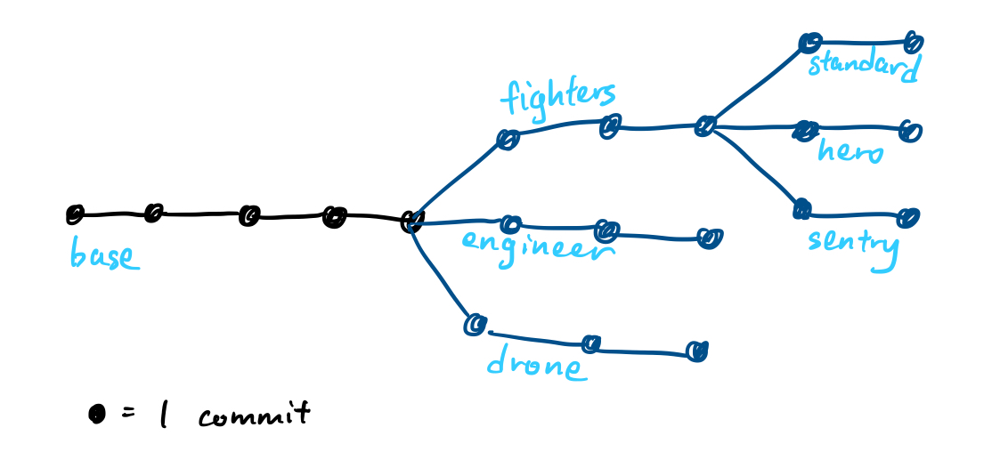
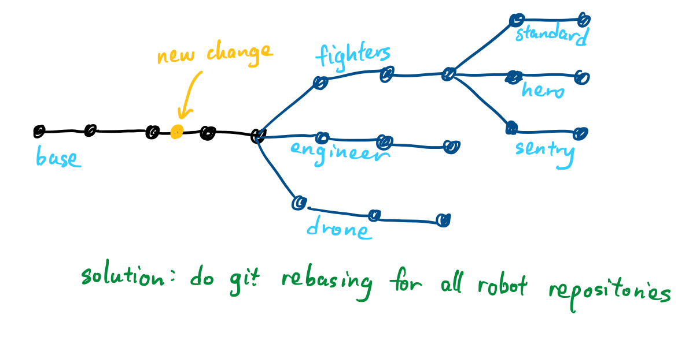

# Github Workflow

The purpose of this document is to highlight the key steps in utilising Git and Github in terms of conducting a proper and well organised development workflow. That means accomplishing the following goals:
- separating each robot's control software into different repositories
- maintaining a `base` repository that is applicable to all robots
- each robot's repository should set `base` as an upstream remote
- within each robot:
  - create a `git branch` and a `Github issue` for each feature
  - making pull requests to merge feature `branch`es into `master`
  - approving pull requests only after comprehensive code reviews
  - squash and merge those `branch`es into `master`

Based on those ideas, our project structure should be as follows.



The ultimate objective of following a set of rigorous procedure during development is to guarantee that the `master` branches of each robot's repository contain code that must work for corresponding robots. It requires the cooperation of all contributing team members through **proper communication**.

### Reading this documentation
We shall take `training_base` being the `base` repository as noted above, and `training_engineer` as our test repository.

We will go through the following in chronological order:
- setting things up
- developing on `training_engineer`
  - making a Github issue
  - creating a feature branch
  - writing, committing and pushing code
  - making a pull request
  - creating another feature branch
  - conducting code review and approving PR
  - squashing and merging a branch
  - rebasing a branch against master
  - making another pull request
- making changes to `training_base`
- rebasing against `training_base` in `training_engineer`

## Setting things up
Clone the `training_engineer` repository.

`git clone [url]`

In `training_engineer`, setup an upstream `base` remote, using `training_base`.

`git remote add base [base_url]`

Check if the remote has been correctly set up.

`git remote -v`

You should expect to see something similar to this.
```
base	https://github.com/HKURoboMaster/training_base.git (fetch)
base	https://github.com/HKURoboMaster/training_base.git (push)
origin	https://github.com/HKURoboMaster/training_engineer.git (fetch)
origin	https://github.com/HKURoboMaster/training_engineer.git (push)
```

## Developing on `training_engineer`
Say, we are developing two features in parallel:
- power-limit
- raising

### Making a Github issue
On Github, open a new issue:
- write as much details as you can in terms of what you want to see being achieved through this feature
- choose assignees, labels, and projects

Let's do `power-limit` first.

### Creating a feature branch
Create a new git branch, and check-it-out.

`git checkout -b power-limit`

### Writing, committing and pushing code

Write some serious code, and commit. Now, we push this `power-limit` branch to `training_engineer` via the `origin` remote.

`git push -u origin power-limit`

### Making a pull request
On Github, make a pull request:
- write as much details as you can in the 'comment' section.
- close the corresponding Github issue
- choose reviewers, assignees, labels and projects

### Creating another feature branch
Now, let's say we develop `raising` feature in parallel.

Open another issue related to `raising`.

Create a new git branch from master, and check-it-out.

`git checkout master`
`git checkout -b raising`

Write, commit and push code as usual.

Push to a different branch.

`git push -u origin raising`

### Conducting code review and approving PR
Reviewers shall look through your code, make comments on specific lines of code, and request changes if necessary.

### Squashing and merging a branch
If at least 1 reviewer has approved the PR, either the reviewer or the author of the PR can do a "squash and merge" operation, which will merge the `branch` into `master`.

Let's merge `power-limit` into `master`.

### Rebasing a branch against master
As you may have noticed, the `raising` branch is now behind `master`. That means, if we try to merge `raising` into master now, there would be conflicts.

This is where `git rebase` comes in. Here's how it works. Analogy used: stacking sandwiches.


Here are the steps:
1. Checkout to master and pull.

`git checkout master`
`git pull`
`git checkout -i raising`

2. Use git rebase.

`git rebase -i master`

3. Resolve any conflicts.

4. Push to the `raising` branch by force.

`git push -f`

**Bonus tips:** Most git conflicts can be avoided if developers respect what each other is doing. While building a feature, try to restrict to just building that feature, do not change anything else. If you feel that you are unable to proceed the building process because it involves a certain bug fix that is under the jurisdiction of another feature (or another developer), communicate with that developer and try to fix that problem first. Do a git rebase afterwards, and you will be able to continue building the original feature you have set out to do.

### Making another pull request
Now, we conclude this section by making a pull request for `raising`. The usual, code review and merging procedures follow afterwards.

## Making changes to `training_base`
Let's say a certain change (like a protocol update) must be made to all of the robots. We do that in the `base` repository as such.

Create a feature `branch` within `training base`. Write, commit and push code to that `branch`.

The usual pull request / review / merging procedures are applied here as well.



## Rebasing against `training_base` in `training_engineer`

The same `git rebase` idea within `training_engineer` can be used across 2 repositories as well. This is where the initial `git remote` setup step becomes significant.

Now, move into `training_engineer`. To be safe, let's do the rebase in a `branch` as well; let's call it `rebase`.

`git checkout master`
`git pull`
`git checkout -b rebase`

Also, we have to fetch the latest code from our `base` remote.

`git fetch base`

Rebase against the `master` branch of the `base` remote (refers to `training_base` repository).

`git rebase -i base/master`

Resolve any conflicts, in which we usually do see some.

## Conclusion
Resolving conflicts through rebasing can be a pain, sometimes it may take up to 5 maybe 10 minutes to carefully go through each commit and making sure that the correct block of code is selected. However, patience pays off very well in this regard because it truly ensures that we always have a set of working software that we can implement in our robots.
